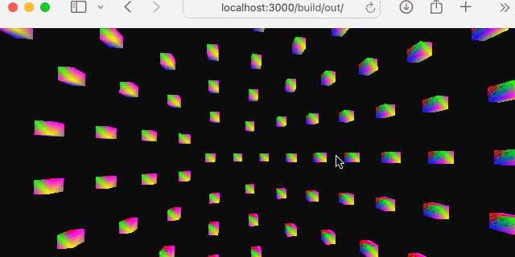

# WebGPU Experiment

Live build at:

🔗 **[WebGPU Experiment Live Demo](https://nickvanderpyle.github.io/webgpu-throwaway/)**

## Getting Started

To explore the project locally, follow these steps:

1. **Clone the Repository**
2. **Open in VSCode**
    - Open the cloned repository in Visual Studio Code using the [Dev Containers extension](https://marketplace.visualstudio.com/items?itemName=ms-vscode-remote.remote-containers).
3. **Build the Dev Container**
    - If this is your first time building the container, you may need to reload the window after the build completes for the Live Preview extension to function properly.
4. **Select Debug CMake Preset**
    - If the Debug CMake build preset is not automatically selected, manually choose it via the CMake extension in VSCode.
5. **Build the Project**
    - Use the CMake extension in VSCode to build the project.
6. **Run the Project**
    - On your host machine, open a web browser and navigate to `http://localhost:3000/build/out/`.

### Dev Container Setup

The Dev Container sets up necessary dependencies for the project, including:

- **Emscripten**: For compiling C++ to WebAssembly.
- **Clangd**: For C++ language server & Clang-Tidy.
- **WGSL Language Server**: For WebGPU Shader Language Server.
- **VSCode Extensions**: Essential extensions like CMake, Live Preview, and others.
